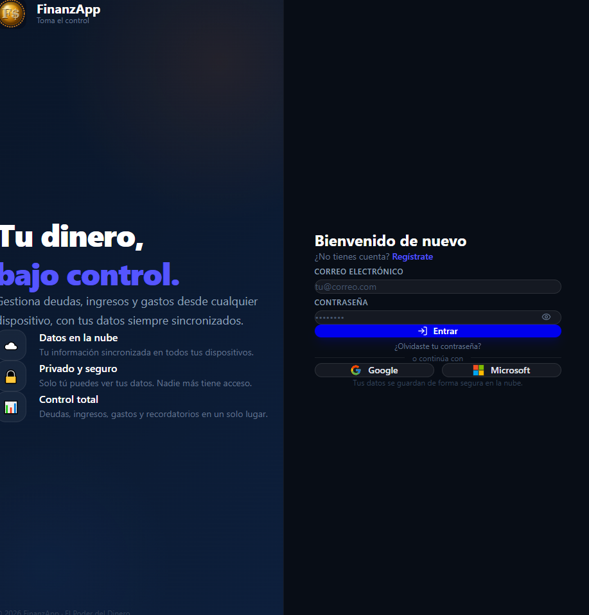
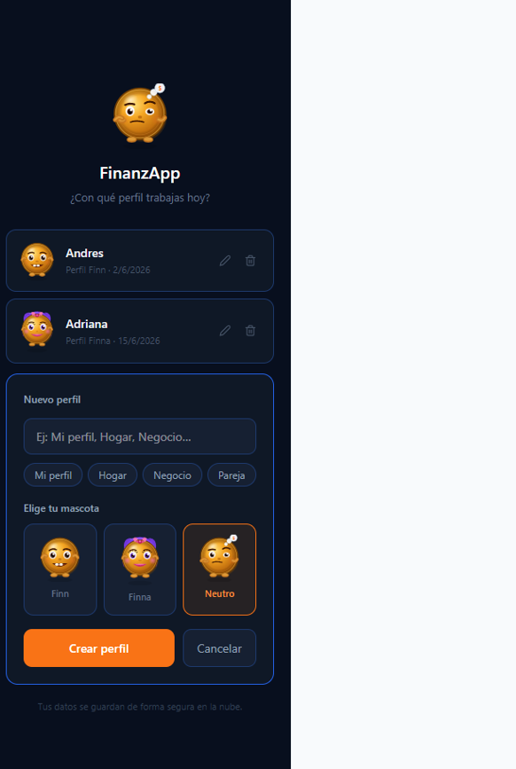
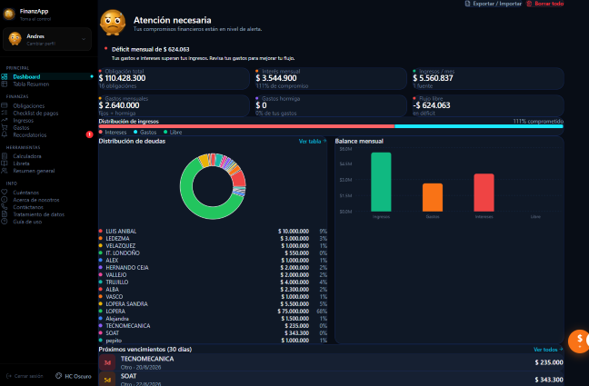
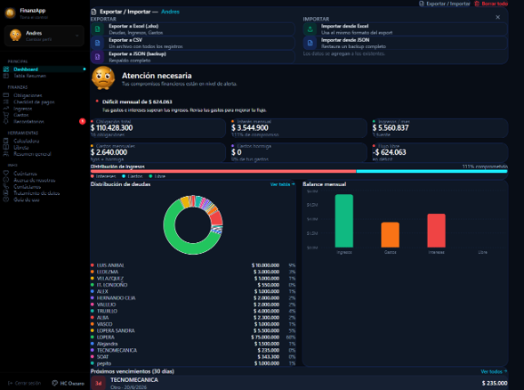

# FinanzApp 💰 - El Poder del Dinero v2.0

FinanzApp es una aplicación web orientada a la gestión de finanzas personales, que permite a los usuarios organizar sus ingresos, controlar sus gastos y visualizar su información financiera de manera clara e interactiva.

---

## 🚀 Propósito

El objetivo del proyecto es proporcionar una herramienta práctica que ayude a los usuarios a comprender su comportamiento financiero y tomar mejores decisiones económicas.

Además, el proyecto sirve como base para el aprendizaje de desarrollo frontend y gestión de estado en aplicaciones modernas.

---

## 🧩 Funcionalidades principales

- Gestión de ingresos y gastos
- Visualización de datos financieros
- Interfaz moderna e intuitiva
- Sistema de temas personalizables estilo VS Code
- Persistencia de preferencias en localStorage

---

## 🎨 Selector de Temas

Esta versión incluye 13 temas inspirados en Visual Studio Code:

**Oscuros:**  
Dark Modern, One Dark Pro, Dracula, Night Owl, Tokyo Night, Monokai, Solarized Dark, Gruvbox Dark  

**Claros:**  
Light Modern, GitHub Light, Solarized Light  

**Alto Contraste:**  
HC Oscuro, HC Claro  

El selector aparece en:

- **Desktop:** esquina inferior del sidebar  
- **Móvil:** dentro del menú "Más"  

El tema seleccionado se guarda automáticamente en `localStorage`.


---

## 📸 Demo

### 🔐 Inicio de sesión


### 👤 Selección de perfil


### 📊 Dashboard financiero


### 📥 Exportación e importación de datos


---

## 🛠️ Instalación

```bash
npm install
npm run dev


